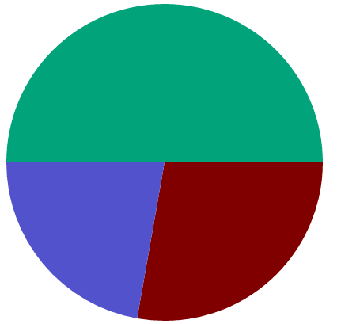

piechart
========

Piechart on an HTML canvas.



This module is based on this [blogpost](http://wickedlysmart.com/how-to-make-a-pie-chart-with-html5s-canvas/)

Usage
-----

```js
var piechart = require('piechart');

piechart(document.getElementById("piechart"), [
  {value: 100, color: '#800000'},
  {value:  80, color: '#5252CC'},
  {value: 180, color: '#00A37A'}
]);
```

License
-------

MIT
